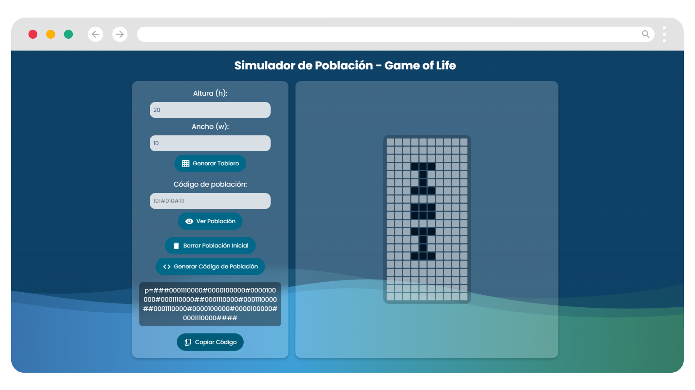

# Simulador de Población Inicial - Juego de la Vida

## Descripción
Este proyecto es un **Simulador de Población Inicial** para el **Juego de la Vida** de Conway. Está implementado en HTML, CSS y JavaScript, y permite a los usuarios generar y visualizar tableros de población, así como manipular la población inicial mediante una interfaz gráfica intuitiva.

## Características
- Generación de tableros de población con dimensiones personalizables.
- Visualización y modificación de la población inicial mediante clics.
- Generación y copia de códigos de población en formato de texto.
- Diseño adaptable con un fondo degradado y una interfaz limpia.

## Imagen de la Página



## Instalación

1. Clona el repositorio:
   ```bash
   git clone <URL_DEL_REPOSITORIO>
